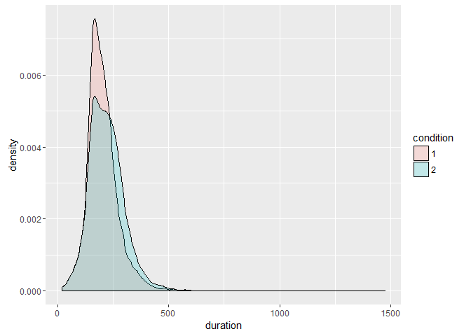
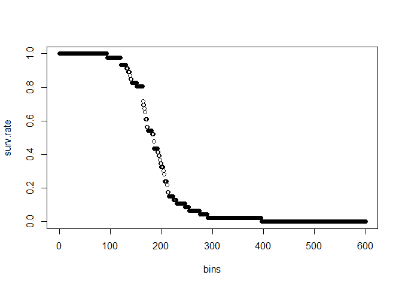
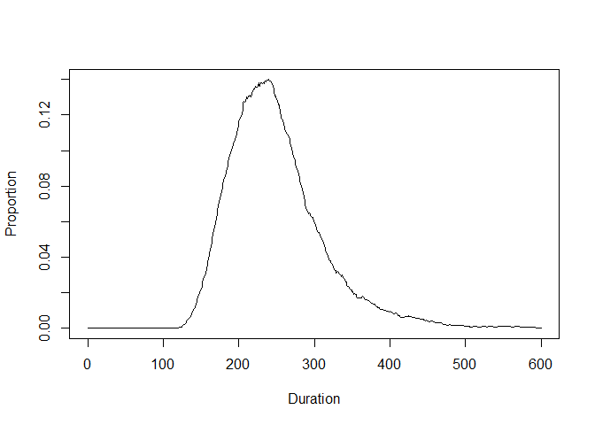
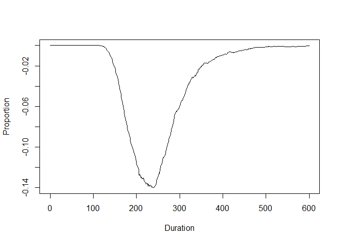
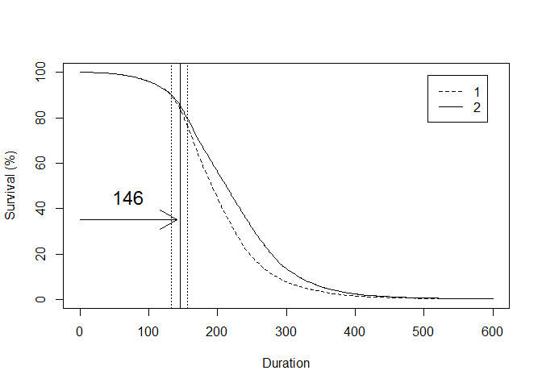

RTsurvival
================

<!-- README.md is generated from README.Rmd. Please edit that file -->
[](https://travis-ci.org/matsukik/RTsurvival)

A set of R functions to perform survival analysis on reaction time (RT) data.

Origianl MATLAB routines
------------------------

The package is a modification and R port of the MATLAB routines developed by [Eyal Reingold](https://www.utm.utoronto.ca/psychology/people/faculty/eyal-reingold) and [Heather Sheridan](http://www.albany.edu/psychology/60729.php) in [Reingold & Sheridan (2014)](http://journal.frontiersin.org/article/10.3389/fpsyg.2014.01432/full). The original MATLAB routines are part of Supplementary Material in Reingold & Sheridan (2014), and are distributed under [Creative Commons Attribution License (CC BY)](https://creativecommons.org/licenses/by/3.0/)

Current R package
-----------------

This package implements following routines:

-   `surv.mean` which computes the mean survival curves (or difference curve) of RT data from a two condition experiment with multiple participants.
-   `DPA.orig` which performs divergence point analysis that were introduced in Reingold, Reichle, Glaholt, & Sheridan, (2012).
-   `DPA.ci` which estimates the divergence point and its confidence interval, so that the significance of the difference between experimental conditions can be assessed.
-   `DPA.ip` which estimates the individual specific divergence point for each participants.

All of the above routines come with an associated `plot` function for easy plotting.

Installation
------------

To install the RTsurvival package from GitHub, first install devtools and then run

``` r
devtools::install_github("matsukik/RTsurvival")
```

Example
-------

### Loading and checking the data

First, load the library and a sample data:

``` r
library(RTsurvival)
data(DPAsample)
DPAsample$condition <- factor(DPAsample$condition)
str(DPAsample)
#> 'data.frame':    11060 obs. of  3 variables:
#>  $ subject  : int  1 1 1 1 1 1 1 1 1 1 ...
#>  $ duration : int  94 121 121 132 135 139 140 142 152 164 ...
#>  $ condition: Factor w/ 2 levels "1","2": 1 1 1 1 1 1 1 1 1 1 ...
```

The sample data contains 104 participants, each with approximately 100 data points:

``` r
n.per.sbj <- table(DPAsample$subject)
length(n.per.sbj)
#> [1] 104
range(n.per.sbj)
#> [1]  74 120
```

The condition 1 ("blue" in the plot below) seems to be faster than condition 2 ("red" in the plot below), in terms of grand means and distribution:

``` r
tapply(DPAsample$duration, DPAsample$condition, mean)
#>        1        2 
#> 203.4087 221.6727
library(ggplot2)
ggplot(DPAsample, aes(x=duration, fill=condition)) + geom_density(alpha=.2)
```



As you will see below, it is critical that levels of the condition is ordered such that the faster condition comes first (either in term of number or as the level of a factor).

### Calculating and plotting the curves

To plot survival curves, first run `surv.mean`:

``` r
mean.curv <- surv.mean(DPAsample$subject, DPAsample$duration, DPAsample$condition)
plot(mean.curv)
```


The `surv.mean` function is a wrapper around a function `surv.curv`. To calculate or plot survival curve for a single condition for a single participant (e.g., subject 1 condition 1), do:

``` r
tmp <- subset(DPAsample, DPAsample$subject == 1 & DPAsample$condition == 1)
bins <- 0:600
surv.rate <- surv.curv(tmp$duration, .bin = bins)
plot(x=bins, y=surv.rate)
```



You can also plot the mean difference between the curves by setting `dif.plot = TRUE`:

``` r
plot(mean.curv, dif.plot = TRUE)
```



As mentioned earlier, if the condition is not coded properly, the plot will be an mirror image and the divergence point analysis will most likely fail:

``` r
DPAsample$condition2 <- factor(DPAsample$condition, levels=c(2, 1), ordered=TRUE)
mean.curv2 <- surv.mean(DPAsample$subject, DPAsample$duration, DPAsample$condition2)
plot(mean.curv2,dif.plot = TRUE)
```



### Divergence Point Analysis (DPA)

There are currently three ways to estimate the divergence point of two survival curves. One is the the method introduced by Reingold et al. (2012), which Reingold & Sheridan (2014) refereed to as "original", and is implemented as a function `DPA.orig`. The other two methods were introduced in Reingold & Sheridan (2014): Confidence Interval DPA Procedure, implemented as `DPA.ci` and Individual Participant DPA Procedure, implemented as `DPA.ip`.

Here, an example using `DPA.ci` is shown. The model fitting is quite simple:

``` r
ci.dpa <- DPA.ci(DPAsample$subject, DPAsample$duration, DPAsample$condition, quiet = TRUE)
print(ci.dpa)
#> 
#> Method of Estimation:
#> [1] "CI"
#> Divergence Point Estimate:
#> [1] 146
#> Confidence Interval:
#>  2.5% 97.5% 
#>   133   156
```

For more details on the other arguments and available outputs, please refer to the help topics.

The resulting object of DPA.ci (as well as `DPA.orig` and `DPA.ip`) can be fed to the plot function along with with output of surv.mean or easy plotting of the curves as well as estimate of the divergence point (and the confidence interval too in this case).

``` r
plot(mean.curv, dp.point = ci.dpa, add.arrows = TRUE)
```


